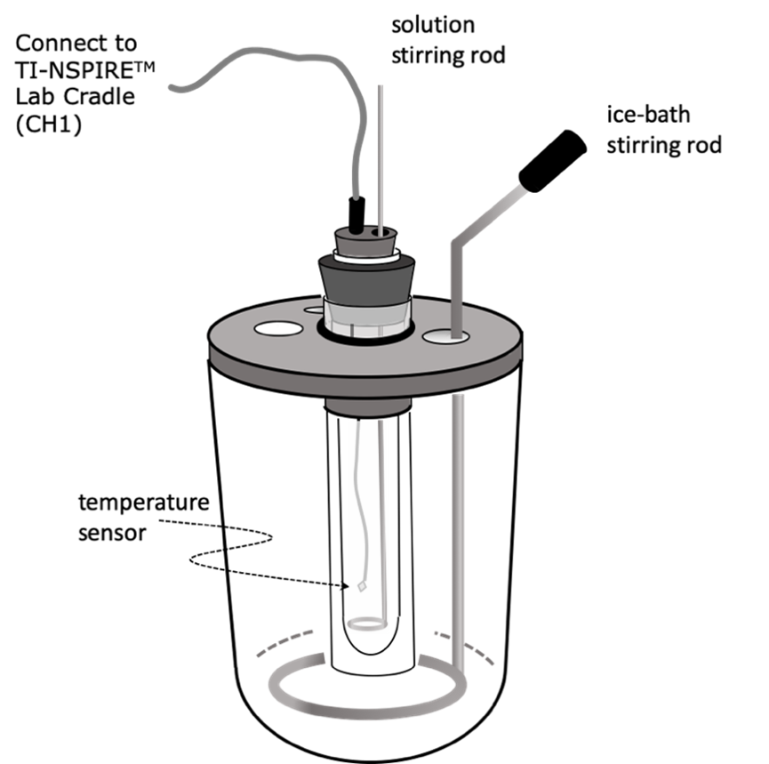
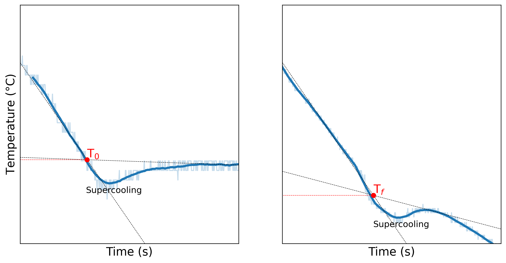
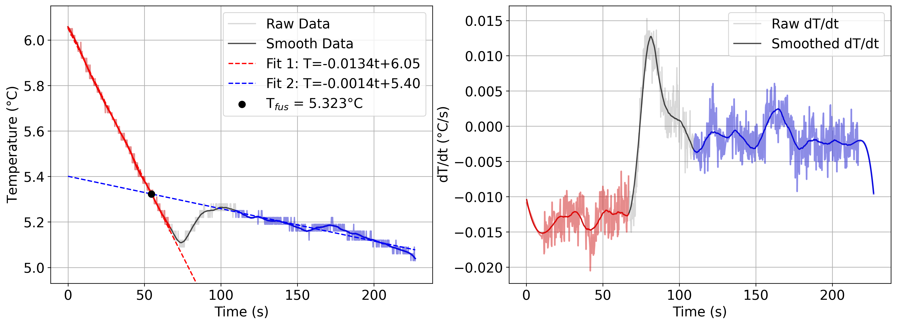

# FREEZING POINT DEPRESSION

> [!NOTE]
> Freezing point depression
> 
> Gibbs-Helmholtz equation
> 
> Chemical potential
> 
> $\Delta H_{fus}$, $\Delta S_{fus}$, $\Delta G_{fus}$
> 
> Data Filtering
> 
> Python Functions

In 1868, Alfred Nobel was awarded a US patent for inventing a way to safely transport and use the highly explosive compound nitroglycerin. Nitroglycerin shock-detonates with very little provocation, so his novel idea was to mix nitroglycerin with diatomaceous earth (an absorbent filler) making the explosive portable.[^1] His invention was known as dynamite. However, dynamite was still unstable at cold temperatures ($T_\text{fus}$ is 13.5$\degree$C /56.3$\degree$F for nitroglycerin). When the nitroglycerin crystallized, the friction between crystals was enough to provoke detonation. It was found that mixing another liquid explosive, ethylene glycol dinitrate ($T_\text{fus}$ is -23$\degree$C / -9$\degree$F) with the nitroglycerin produced a more stable product. A 50:50 mixture of nitroglycerine with ethylene glycol dinitrate results in a freezing temperature of -20$\degree$C (-4$\degree$F).[^2] This phenomenon is called *freezing point depression*.

A common, every-day application of this phenomenon is the "antifreeze" fluid for car engines. Car radiators are filled with a mixture of water and ethylene glycol as a coolant. A 50:50 solution of ethylene glycol and water has a freezing temperature of -37$\degree$C (-34.6$\degree$F) allowing for the coolant to circulate even in sub-zero temperatures.

**7.1.** The solid-liquid interface at thermal equilibrium

## Thermodynamic Background

The dynamic solid-liquid interface is shown in Figure [7.1](#Fig7-1-Interface). It is dynamic because, at thermal equilibrium and constant pressure, the rate of melting (solid$\rightarrow$liquid) is the same as the rate of freezing (liquid$\rightarrow$solid). The liquid-solid interface is in constant flux with the rates of melting and of freezing in balance. Adding a *solute* to the liquid phase decreases the rate of freezing while not affecting the rate of melting. Thus, with the addition of the solute to the liquid, more of the solid melts until thermal equilibrium may be reached again at a lower temperature.

From a qualitative thermodynamic point of view, we can understand freezing point depression by considering $\Delta G_{fus}$ ("fus" is fusion, solid$\rightarrow$liquid) and that addition of a solute to the liquid increases the entropy of the liquid. 

$$
\begin{align}
\Delta G_{fus} &=\Delta H_{fus} - T\Delta S_{fus} \\
\Delta S_{fus} &= S_{liquid} - S_{solid} \end{align}
$$

 When $S_{liquid}$ increases, so does $\Delta S_{fus}$ ($S_{solid}$ is unchanged by the addition of solute to the liquid). Thus, $\Delta G_{fus}$ becomes more negative, pushing the solid$\rightarrow$liquid equilibrium forward. It is important to note that the decrease in $\Delta G_{fus}$ is not because of a change in $\Delta H_{fus}$ (which would imply a change in the entropy of the surroundings). Rather, $\Delta G_{fus}$ decreases because $\Delta S_{fus}$, that is $\Delta S_\text{SYSTEM}$, increases. Thermodynamic analysis allows for a more quantitative application of the phenomenon of freezing point depression. Return again to the qualitative description of the equilibrium as when the rate of melting (solid$\rightarrow$liquid) is the same as the rate of freezing (liquid$\rightarrow$solid). Thermodynamically, this means that the chemical potential for the substance $A$ is equal in both phases, solid and liquid. 

$$
\mu_A(s) = \mu_A(l)
$$

 The solid will be considered a pure substance while the liquid is treated as an ideal solution with the solvent mole fraction, $\chi_A$.[^3] 

$$
\mu_A^*(s)=\mu_A^*(l) + RTln\chi_A
$$

 Since the chemical potential, $\mu$, is the molar Gibbs energy, $G_m$, we can rewrite Equation [7.4](#Eq7-4-ChemPotChi) as follows.

$$
\begin{align}
\mu_A^*(s) - \mu_A^*(l) &= -\Delta G_{fus} = RTln\chi_A \\
-\dfrac{\Delta G_{fus}}{RT} &= ln\chi_A \end{align}
$$

Recognizing and using Taylor series and Maclaurin series is an important take-away from 2nd semester Physical Chemistry. Let $\chi_B$ be the mole fraction of the *solute*, $B$. If $\chi_B \ll$1 , then we may make the following reduction: 

$$
\begin{eqnarray}
ln \chi_A = ln(1-\chi_B) = -\chi_B  \\
-\dfrac{\Delta G_{fus}}{RT} = -\chi_B \end{eqnarray}
$$

Now take the derivative of both sides with respect to T.

$$
\dfrac{1}{R}\dfrac{d}{dT}\bigg(\dfrac{\Delta G_{fus}}{T}\bigg) = \dfrac{d\chi_B}{dT}
$$

The left side of Equation [7.8](#Eq7-8-dGderiv) is recognizable as the Gibbs-Helmholtz equation.[^4]

$$
\begin{align}
-\dfrac{\Delta H_{fus}}{RT^2} &=\dfrac{d\chi_B}{dT} \\
-\dfrac{\Delta H_{fus}}{RT^2}dT&=d\chi_B \end{align}
$$

Now both sides are integrated, with T$^*$ being the melting point of the pure solvent, $A$.

$$
-\dfrac{\Delta H_{fus}}{R} \int_{T^*}^T \dfrac{dT}{T^2} =\int_0^{\chi_B} d\chi_B
$$

 

$$
\dfrac{\Delta H_{fus}}{R}
\bigg(\dfrac{1}{T}-\dfrac{1}{T^*}\bigg) = -\dfrac{\Delta H_{fus}}{R}
\bigg(\dfrac{1}{T^*}-\dfrac{1}{T}\bigg) =\chi_B
$$

Since $T^*$ and $T$ differ by a small amount relative to $T^*$, we can make the following reductions:

$$
\bigg(\dfrac{1}{T^*}-\dfrac{1}{T}\bigg) = \dfrac{1}{TT_{fus}^*}(T-T_{fus}^*)\approxeq\dfrac{\Delta T}{T_{fus}^{*2}}
$$

 

$$
-\dfrac{\Delta H_{fus}}{RT_{fus}^{*2}}\Delta T = \chi_B
$$

 

$$
\Delta T = -\dfrac{\chi_BRT_{fus}^{*2}}{\Delta H_{fus}} = -K_f\chi_B
$$

 $K_f$ is the freezing-point depression constant for the solvent. Before moving on, it is important to look at a *qualitative* conclusion from Equation [7.14](#Eq7-14-Reductions). $\Delta H_{fus}$, $R$, $T^*$, and $\chi_B$ are all *positive* numbers. Thus, $\Delta T$ must be negative which indicates that the melting/freezing temperature is *lowered* by the addition of a solute: *freezing point depression*. Lowering the melting/freezing temperature effectively pushes the solid$\rightarrow$liquid equilibrium forward. Here we have shown by thermodynamic analysis that which we reasoned above with Equations [7.2](#Eq7-2-DSfus) and [7.3](#Eq7-3-ChemicalPotential). Freezing point depression is a useful tool from determining the molar mass of an unknown solute that is soluble in a known solvent. Equation [7.15](#Eq7-15-DeltaT) must be manipulated to be in terms of the molality of $B$ in the solution, $b_B$. In the limit that $\chi_B\ll$1 and $\chi_A\approxeq$1, $b_B$ and $\chi_B$ are related by Equation [7.16](#Eq7-16-bB).

$$
b_B=\dfrac{n_B}{m_A} =\dfrac{\chi_B n_\text{TOT}}{\chi_A n_\text{TOT} M_A }=\dfrac{\chi_B}{M_A} 
$$

Using the relationship in Equation [7.16](#Eq7-16-bB), we can re-write Equation [7.15](#Eq7-15-DeltaT) in terms of the molality of the solute.

$$
\Delta T = -K_fM_Ab_B = -K_{f}^{'} b_B
$$

where $M_A$ is the molar mass of A. You will calculate $K_{f}^{'}$ for the solvent (cyclohexane) as part of the pre-lab assignment. Be careful with units, remembering that the units of molality are $\dfrac{\text{moles solute}}{\text{kg solvent}}.$

## Procedure

In this experiment you will determine the molar mass of an unknown organic solid by measuring how much the freezing point is lowered the addition of a measured amount of an unknown solute is added to a weighed amount of cyclohexane. This technique should allow you to determine the molar mass ($\le$500 g/mol) of a substance to within 3 to 5%.

The experimental set-up is shown in Figure [7.2](#Fig7-2-Beckmann). The set-up is a Beckmann cryoscopic apparatus, named for the physical chemist Ernst Otto Beckmann (1853-1923) who invented the technique in 1887. The apparatus consists of a nested set of three containers. The innermost container is a test tube into which the solvent and solute are placed and monitored with a thermometer as the temperature is lowered. The outermost container is a large glass vessel in which the cooling medium is placed. In this experiment, the cooling medium is ice-water with salt. The innermost container is separated from the outermost contained by a buffer container with an air-gap. The reason for this middle container is to ensure that the temperature is uniform in the innermost container during the cooling. Both the innermost and outermost containers have a manual stirring rod used for maintaining temperature uniformity.

**7.2.** The Beckmann cryoscopic apparatus

Temperature will be monitored with a Vernier Surface Temperature Sensor (STS-BTA) integrated with a PC through the TI Lab Cradle and software (see Appendix [A](#AppA-TI)). The Vernier-BTA temperature sensor has $\Delta_{95}T$ of 0.03$\degree$C.

The solvent used in this experiment is cyclohexane and should be handle in the hood with all appropriate safety measures taken (googles and gloves). A waste container will be provided for the used cyclohexane-solute mixtures. Be aware of the safety, exposure and abatement procedures for this chemical. Your pre-lab assignment will cover these aspects of the experiment. Here is a link to the MSDS for cyclohexane for your reference: [MSDS for cyclohexane](https://www.sigmaaldrich.com/US/en/sds/sial/227048?srsltid=AfmBOoovvQ6oM7tgspmxTHS3-3SvJMQvEYd3xjRmwjAhaqtKw9IMOsoI)

**SET UP DATA COLLECTION** in the Student Software as follows:

----------------------- --------------------------------------
  **Units:** $\degree$C   **Decimal points:** 2
  **Duration:** 180s      **Rate:** Interval mode, 5 samples/s
  ----------------------- --------------------------------------

### STEP 1. Determine the freezing point of $\sim$30 mL of pure, dry cyclohexane

- Determine the mass of the 30 mL sample of cyclohexane and transfer it to the innermost tube.

- Use an ice-water mixture as the coolant in the outermost beaker. (Note that the middle test tube remains empty). Add rock salt to bring the ice-water mixture to roughly -3$\degree$C. If the temperature is lower than -3$\degree$C, that is fine. Stir the ice-water mixture periodically to maintain the temperature.

- Good results depend on proper stirring of the cyclohexane. The motion of the stainless-steel stirrer should carry it from the bottom of the test tube to the surface of the liquid and back again. This should be done gently at a rate of 1 stroke per second.

- To determine the freezing point, you will plot temperature against time. For pure cyclohexane, start the data collection as soon as the temperature of the cyclohexane solution reaches 7.5$\degree$C. Continue taking readings for at least 3 minutes after freezing begins. Save the temperature-time data as an Excel file.

- Figure [7.3](#Fig7-3-Graphs) shows typical cooling curves a pure solvent and for a solution with a non-volatile solute.[^5]

**7.3.** Typical cooling curves for a pure substance (left) and a mixture (right). The pure substance should yield a flat line after supercooling (minimum), whereas the mixture shows a sharp decrease. Data provided by Suzie Hwang, Maria Kaiser, and Asa Waterman (Class of ’23).

### STEP 2. Determine the freezing point for the solvent with a small amount of dissolved solute

- Weigh 0.2-0.3 g of p-dibromobenzene (pDBrB).

- Remove the innermost tube and allow the cyclohexane to liquefy before adding the pDBrB. Take care to get all of the solute into the liquid (none stuck to the side above the liquid)

- When all the solid has dissolved, reassemble the apparatus and record the temperature-time readings as in **STEP 1**. This time, wait until the temperature reaches 7$\degree$C before collecting data.

### STEP 3.

Repeat **STEP 2** with an with an additional 0.2-0.3 g pDBrB added to the solution. This time, wait until the temperature reaches 6.5$\degree$C before collecting data.

### Python Data Analysis

Once the data is organized, you will use a Jupyter Notebook to interactively determine T$_\text{fus}$. The Jupyter Notebook for the requisite data analysis is uploaded to Brightspace.

1.  You will use the rolling average and the Savitzky-Golay filter to smooth your noisy temperature data.

2.  You will plot the derivative of the smoothed temperature data and create data filters to selectively choose regions for analysis.

3.  You will use create linear regressions from the smoothed data for pre- and post-supercooling. Then, you will use Cramer's Rule to determine the intersection between both lines, i.e., T$_\text{fus}$.

4.  You will then use an interactive figure to do the analysis based on your data set.

5.  Use the calculated T$_\text{fus}$ for cyclohexane and your mixtures to determine the molar mass of p-dibromobenzene.

**7.4.** The results of the interactive graph to determine Tfus based on choosing the times pre- and post-supercooling via interactive sliders in Python. Data used in this figure was provided by Suzie Hwang, Maria Kaiser, and Asa Waterman (Class of ’23).

## Required Elements for the Lab Report

### Introduction

1.  Show an understanding of how freezing point depression is understood qualitatively from the 2nd Law of Thermodynamics.

2.  Show a clear grasp of the thermodynamic derivation that leads to Equation [7.17](#Eq7-17-DeltaTKf).

### Tables and Calculations

1.  In the **Procedure** section, include a table with the masses of the unknown solute (including "0" for **STEP 1**) and the mass of cyclohexane (same for all three trials).

2.  In the **Results and Discussion** section, include the following table for the three trials:

    +:-----:+:----:+:-----------:+:--------------:+:------------:+:------------:+:------------------------------------------------:+
    | Trial | mass | mass solute | $T_\text{fus}$ | $\Delta$T    | b$_\text{B}$ | mm$_\text{B}$ $\pm$ $\Delta_{95}$mm$_\text{B}$ |
    |       +------+-------------+----------------+--------------+--------------+--------------------------------------------------+
    |       | (kg) | \(g\)       | ($\degree$C)   | ($\degree$C) | (mols/kg)    | (g/mol)                                          |
    +-------+------+-------------+----------------+--------------+--------------+--------------------------------------------------+
    | 1     |      | 0           |                |              |              |                                                  |
    +-------+------+-------------+----------------+--------------+--------------+--------------------------------------------------+
    | 2     |      |             |                |              |              |                                                  |
    +-------+------+-------------+----------------+--------------+--------------+--------------------------------------------------+
    | 3     |      |             |                |              |              |                                                  |
    +-------+------+-------------+----------------+--------------+--------------+--------------------------------------------------+

3.  Explain how you did the following:

    - used the Python code to determine $T_\text{fus}$. Explain your choice of fitting parameters for the rolling average and/or the Savitzky-Golay filter.

    - calculated $b_B$, the molar mass of $B$ ($mm_B$), and its uncertainty ($\Delta_{95}mm_B$) (Equation [7.17](#Eq7-17-DeltaTKf)).

4.  Comment on what experimental error contributes most to the error in molar mass

    - Do your results for both solutions fall within $\Delta_{95}mm_B$? Why or why not?

    - Report the %-error for the $T_{\text{fus}}^*$ (pure cyclohexane) and for the molar mass of pDBrB.

### Figures

1.  Include all cooling curves for the pure solvent and the solutions (**Appendix**). Alternatively, you can include all three cooling curves as a singular figure (1 row x 3 columns OR 3 rows x 1 column using plt.subplot()) (**Results and Discussion**). Plot the moving average of the temperature data as an overlay onto the raw data. Use differences in visual aspects to push the raw data into the background (lighter color, linewidth=0.5, and transparency (alpha=0.3)) and emphasize the smoothed data (darker color, linewidth=2, and no transparency (alpha=1)).

2.  With one of your cooling curves, include your version of [7.4](#Fig7-4-CombinedFigure) to get the point across of how you did the analysis, but tabulated results can indicate an estimate of the error in $T_\text{fus}$ (**Results and Discussion**). This will be a double column figure in the lab report.

### Discussion Questions

1.  Comment on the qualitative aspects of the cooling curves including

    - Supercooling (if observed, provide a scientific explanation and cite your references)

    - the slope of the cooling curve (give a hypothesis)

2.  Explain the coding modules. Explain how the mathematical techniques used to select data points can justify the choices made. How would the points selected post-supercooling for that best fit line affect $T_{fus}$? Is there a chemical reason to do this? Or is this caused by \"overfitting\", i.e., we are cherry picking data to make the calculations work? How did we use rolling average and Savitzky-Golay filters to smooth the data? Did it make a difference what parameters were set?

3.  Based on the cooling curve, what can you say about the purity of the cyclohexane?

4.  How would impurities in your solvent affect your results?

5.  How does the concentration of the solution influence the accuracy of this method? Can you think of a way to minimize the concentration effects?

6.  If we were to consider the errors in the slopes and intercepts of the best fits in determining $T_\text{fus}$, how would you expect the predicted molar mass to be affected by the $\Delta_{95}$ range (shown as the plt.fill_between as we did in Lab [1](#Lab1-ExpData)) of the intersection? How sensitive is the value of $T_\text{fus}$ to the calculated molar mass?

## Pre-Lab Assignments/Quizzes (5 pts each)

**COMPLETE ALL PRE-LAB ASSIGNMENTS/ QUIZZES BEFORE COMING TO LAB**\

### Experimental Pre-lab Quiz (5 pts)

Show all your work in your lab notebook clearly marked as "PRELAB WORK"\

Make a clear beginning in the notebook for Lab [7](#Lab7-FPD). Answer the following questions in your notebook.

1.  Calculate the value of $K_{f}^{'}$ for cyclohexane from Equations [7.15](#Eq7-15-DeltaT) and [7.17](#Eq7-17-DeltaTKf). Use correct units and the following parameters for cyclohexane: 

$$
\begin{align*}
T_\text{fus}^*&=6.68\degree \text{C}\\
\Delta H_{fus}^\degree&=2678 \text{ J/mol}      
\end{align*}
$$

2.  Review the MSDS for cyclohexane.

    - What PPE needs to be worn when handling cyclohexane?

    - What is the proper response if you get cyclohexane on your skin? In your eyes?

3.  How should your cyclohexane solution be disposed of at the end of your experiment?

### Python Analysis Pre-Lab Assignment (5 pts)

You will need to download the Rotation 3 pre-lab Jupyter Notebook from Brightspace. Then upload the .ipynb file to your Google Drive and open it in Google Colab. Once the assignment is completed, you will submit a shareable link to Brightspace as your assignment submission. This pre-lab assignment focuses on techniques you will use for data analysis related to Labs [4](#Lab4-Adiabatic) and [7](#Lab7-FPD).

## Lab Notebook Grading Rubric (10 pts)

1.  (**2 pts**) Laboratory notebook set-up

    1.  Notebook labeling

    2.  Table of contents

    3.  Page numbering

    4.  Use of ink

2.  (**8 pts**) Laboratory work

    1.  Neat and organized.

    2.  All data collected in the lab contained in the notebook.

    3.  Each page signed and dated.

    4.  Make sure that you reference your Excel data. This would just be the name of the file since folder structures can change. You do not need to provide your full file path.

## Formal Report Grading Rubric

Submission Instructions: Submit to **Brightspace**

m8cm\|X\|x1cm\|x2cm\| & Formal report \* 0.65 & 65 &\
& Lab notebook & 10 &\
& Assignments/ Quizzes & 25 &\
& Total & 100 &\

\|x3cm\|X\|x1.1cm\|x1.1cm\| Section & Key Points & Points & Grade\
ALL & Formatting & 10 &\
ALL & Spelling and Grammar & 5 &\
Abstract & Clarity and Completeness & 5 &\
& • Purpose and background& \*10 &\
&• Show a qualitative and quantitative understanding on freezing-point depression and Equation [7.17](#Eq7-17-DeltaTKf)&&\
&• Calculation of K$_f$ and K$_f^{'}$ for cyclohexane (from pre-lab)&&\
&• Method to determine molar mass of an unknown solute.&&\
& • Equipment and procedure & \*15 &\
&• Flow (step-by-step)&&\
&• Source and purity of cyclohexane&&\
& • Table of measurements and conditions& \*10 &\
&• Three (3) graphs: T vs. time for cyclohexane and mixtures&&\
&• units and sig figs&&\
&• Table clarity and title&&\
&• Double column figure from Python code&&\
&• Comments/Observations from Python code&&\
& • What is the end goal? & \*20 &\
&• How did you determine **T$_\text{fus}$**?&&\
&• Table of results with correct error components &&\
&• Analysis of the largest components of error &&\
&• Figures, Tables, and Equations in right format&&\
& • Address the discussion questions on page & 20 &\
Conclusion & • Summary, next steps, suggestions & 5 &\
**Total** & & **100** &\

[^1]: Alfred Nobel, Improved Explosive Compound, US Patent No 78,317, May 26, 1868.

[^2]: Johll, Matthew E. Investigating Chemistry. 3rd ed. (New York, NY: W. H. Freeman and Company, 2013),211.

[^3]: P W. Atkins, Physical Chemistry, 11th ed. (Oxford, United Kingdom: Oxford University Press, 2018), 161.

[^4]: Atkins, Physical Chemistry, 108.

[^5]: Figure 7.3 in David P. Shoemaker, Carl W. Garland, and Joseph W. Nibler, Experiments in Physical Chemistry, 5th ed. (New York: McGraw-Hill, 1989), 202.
